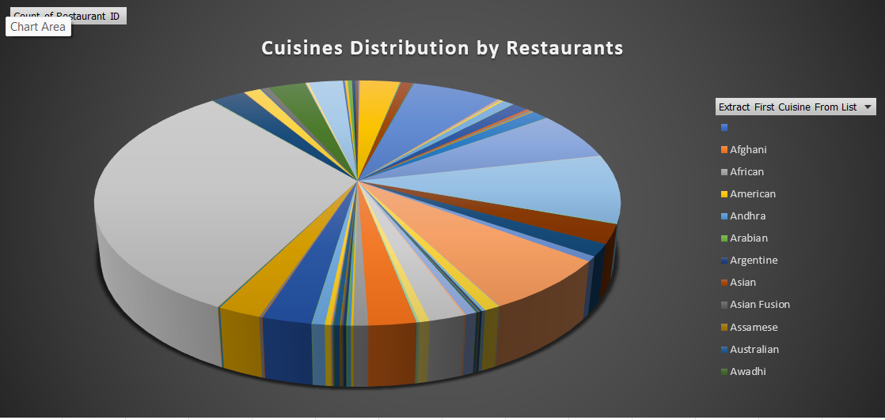

# 🍽️ Restaurant Data Analysis Internship Project

## 📌 Overview
This project is a part of my internship at **Cognifyz Technologies**, where I performed end-to-end data analysis using **Excel**, **Python**, **MySQL**, and **Power BI** on a real-world restaurant dataset.

The main objective was to clean, analyze, visualize, and extract insights from the dataset to understand key patterns in restaurant ratings, cuisines, pricing, and delivery trends.

---

## 📂 Project Structure

## 🧰 Tools & Technologies Used

- **Excel** – Data cleaning, sorting, pivot tables, charts  
- **Python** – Analysis using Pandas, NumPy, Matplotlib, Seaborn  
- **MySQL** – Structured queries for data exploration  
- **Jupyter Notebook** – Code development and visualization  

---

## 📊 Key Analyses Performed

- Average cost vs rating trends
- Top cuisines by popularity
- Discount vs rating impact
- City-wise restaurant comparison
- Top-rated restaurants

---

## 🎯 Goals Achieved

- ✅ Completed over 80% of assigned internship tasks  
- ✅ Cleaned and prepared messy real-world data  
- ✅ Built visual dashboards and gained insights  
- ✅ Created a complete project pipeline from raw data to final presentation  

---

## 📸 Screenshots

  
  

---

## 🎥 Project Walkthrough

📽️ Watch the video: [Task Explanation Video](link-to-your-video-on-Drive-or-YouTube)

---

## 📜 Certification Criteria Met

- ✔️ Task completion > 80%  
- ✔️ Submitted via Google Form  
- ✔️ Evaluation-ready with videos and documentation  

---

## 📬 Contact

- **Name:** Your Full Name  
- **LinkedIn:** [Your LinkedIn](https://www.linkedin.com/in/shyam-dhudiya)  
- **GitHub:** [Your GitHub](https://github.com/shyamdhudiya)  

---

## 🙏 Acknowledgements

Thanks to **Cognifyz Technologies** for the opportunity to explore data analysis in a real-world setting.
